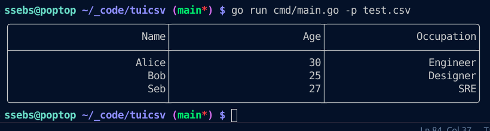

# tuicsv
Text User Interface CSV Editor. Edit CSV files in your terminal.

# MVP
- [x] Load csv file
- [x] Save csv file
- [x] Update csv file
- [x] Render table
- [ ] Scroll + scrollbars
- [ ] Edit cell
- [ ] footer showing status
- [ ] tests
- Shortcuts:
  - [x] hjkl + arrow key navigation
    - [ ] + ctrl to go to end of sheet
    - [ ] + alt to go to next page / scroll
  - [ ] enter to edit cell
  - [ ] delete to clear cell
  - [ ] ctrl + S to save
  - [ ] ctrl + Q, ctrl + C to save & quit

## LICENSE
[Apache License Version 2.0](./LICENSE)
